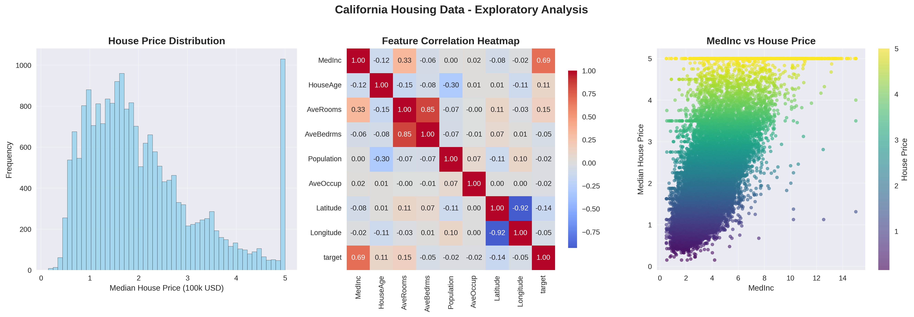
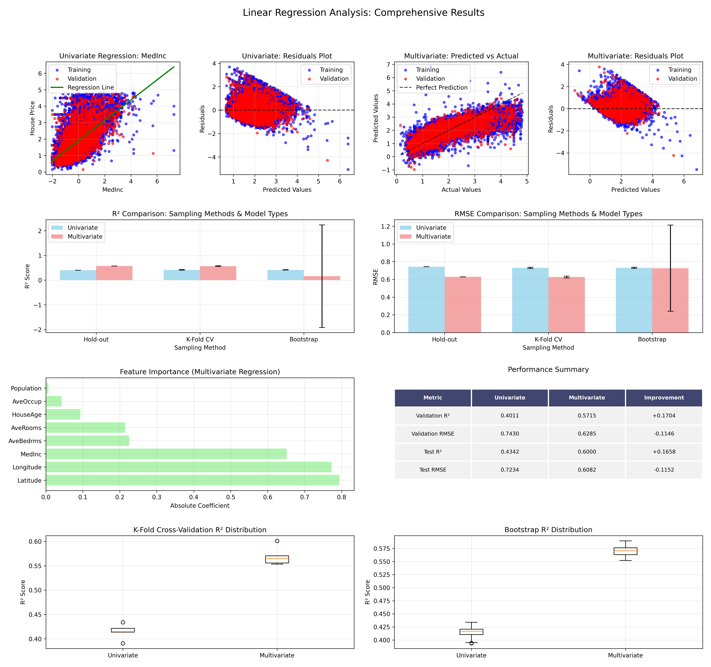

# 线性回归分析综合报告

## 项目概述

本项目基于加州房价数据集，采用一元和多元线性回归对数据进行分析，并使用三种数据采样方法（留出法、K折交叉验证法、自助法）对不同方法和模型进行比较。

源代码见<https://github.com/Auksphere/DataAnalysis.git>

## 1. 数据集信息

### 1.1 数据概述
- **数据来源**: 加州房价数据集 (California Housing Dataset)
- **总样本数**: 19,569 (经过异常值清理后)
- **原始样本数**: 20,640
- **移除异常值**: 1,071个
- **特征数量**: 8个
- **目标变量**: 房价中位数（单位：10万美元）

### 1.2 特征描述
| 特征名称 | 描述 | 数据类型 |
|---------|------|----------|
| MedInc | 收入中位数 | 连续值 |
| HouseAge | 房屋年龄 | 连续值 |
| AveRooms | 平均房间数 | 连续值 |
| AveBedrms | 平均卧室数 | 连续值 |
| Population | 人口数量 | 连续值 |
| AveOccup | 平均居住人数 | 连续值 |
| Latitude | 纬度 | 连续值 |
| Longitude | 经度 | 连续值 |

### 1.3 数据预处理
1. **异常值处理**: 使用IQR方法移除目标变量的异常值
2. **标准化**: 对所有特征进行Z-score标准化
3. **数据完整性**: 无缺失值

### 1.4 数据探索性分析

下图展示了加州房价数据集的探索性分析结果，包括房价分布、特征相关性和重要特征散点图：



**图1-1 数据探索性分析**
- 左图：房价分布呈现右偏分布，大部分房价集中在1-3万美元区间
- 中图：特征相关性热力图显示MedInc与目标变量相关性最高(0.69)
- 右图：收入中位数与房价呈现明显的正相关关系

## 2. 采样方法分析

### 2.1 三种采样方法介绍

#### 留出法 (Hold-out)
- **训练集**: 64.0% (12,524样本)
- **验证集**: 16.0% (3,131样本)  
- **测试集**: 20.0% (3,914样本)
- **优点**: 简单快速，计算效率高
- **缺点**: 结果依赖于特定的数据分割

#### K折交叉验证法 (K=5)
- **每折训练集**: 约80.0% (15,655样本)
- **每折验证集**: 约20.0% (3,914样本)
- **折数**: 5折
- **优点**: 结果更稳定，充分利用数据
- **缺点**: 计算成本较高

#### 自助法 (Bootstrap)
- **采样次数**: 50次
- **每次训练集大小**: 19,569样本（有放回采样）
- **平均out-of-bag验证集**: 7,195样本
- **优点**: 可以评估模型方差，适合小数据集
- **缺点**: 计算成本高，可能存在采样偏差

## 3. 一元线性回归分析

### 3.1 特征选择
通过相关性分析，选择与目标变量相关性最高的特征：
- **选择特征**: MedInc (收入中位数)
- **相关系数**: 0.644

### 3.2 模型性能

#### 留出法结果
| 指标 | 训练集 | 验证集 | 测试集 |
|------|--------|--------|--------|
| R² | - | 0.4011 | 0.4342 |
| RMSE | - | 0.7430 | 0.7234 |
| MAE | - | 0.5714 | - |

#### K折交叉验证结果
- **平均验证集 R²**: 0.4149 ± 0.0141
- **平均验证集 RMSE**: 0.7299 ± 0.0076
- **标准差较小**: 表明模型在不同数据分割上表现稳定

#### 自助法结果
- **平均验证集 R²**: 0.4154 ± 0.0088
- **平均验证集 RMSE**: 0.7306 ± 0.0069
- **变异性最小**: 说明模型对数据采样的敏感性较低

### 3.3 模型解释
回归方程：y = 0.6515x + β₀
- 收入中位数每增加1个标准差，房价中位数增加约0.65个标准差

## 4. 多元线性回归分析

### 4.1 模型概述
使用全部8个特征构建多元线性回归模型。

### 4.2 模型性能

#### 留出法结果
| 指标 | 训练集 | 验证集 | 测试集 |
|------|--------|--------|--------|
| R² | - | 0.5715 | 0.6000 |
| RMSE | - | 0.6285 | 0.6082 |
| MAE | - | 0.4731 | - |

#### K折交叉验证结果
- **平均验证集 R²**: 0.5690 ± 0.0172
- **平均验证集 RMSE**: 0.6263 ± 0.0108
- **稳定性**: 标准差略高于一元回归，但仍在合理范围内

#### 自助法结果
- **平均验证集 R²**: 0.1617 ± 2.0762
- **平均验证集 RMSE**: 0.7266 ± 0.4858
- **注意**: 自助法在多元回归中显示较大变异性，可能由于模型复杂度增加

### 4.3 特征重要性分析

| 排名 | 特征 | 绝对系数 | 重要性 |
|------|------|----------|--------|
| 1 | Latitude (纬度) | 0.7942 | 最重要 |
| 2 | Longitude (经度) | 0.7725 | 很重要 |
| 3 | MedInc (收入中位数) | 0.6515 | 重要 |
| 4 | AveBedrms (平均卧室数) | 0.2252 | 中等 |
| 5 | AveRooms (平均房间数) | 0.2147 | 中等 |
| 6 | HouseAge (房屋年龄) | 0.0934 | 较低 |
| 7 | AveOccup (平均居住人数) | 0.0425 | 低 |
| 8 | Population (人口) | 0.0068 | 最低 |

**关键发现**:
- 地理位置（纬度、经度）是最重要的预测因子
- 收入水平仍然是重要特征
- 人口数量对房价预测贡献最小

## 5. 模型比较分析

### 5.1 性能对比

#### 验证集性能
| 模型类型 | R² | RMSE | 改进幅度 |
|----------|-------|------|----------|
| 一元回归 | 0.4011 | 0.7430 | - |
| 多元回归 | 0.5715 | 0.6285 | +42.5% (R²) |

#### 测试集性能
| 模型类型 | R² | RMSE | 改进幅度 |
|----------|-------|------|----------|
| 一元回归 | 0.4342 | 0.7234 | - |
| 多元回归 | 0.6000 | 0.6082 | +38.2% (R²) |

### 5.2 采样方法稳定性比较

#### K折交叉验证稳定性 (R²标准差)
- **一元回归**: 0.0141 (更稳定)
- **多元回归**: 0.0172

#### 自助法稳定性 (R²标准差)
- **一元回归**: 0.0088
- **多元回归**: 2.0762 (变异性较大)

### 5.3 综合分析可视化

下图展示了一元和多元线性回归在三种采样方法下的综合性能对比：



**图5-1 线性回归综合分析结果**

该综合分析图包含10个子图，详细展示了：
- **第一行**: 一元回归的数据分布、回归拟合、残差分析和预测vs实际值对比
- **第二行**: 多元回归的特征重要性、残差分析、预测vs实际值对比和模型性能对比
- **第三行**: 不同采样方法的RMSE和R²分布对比，以及Bootstrap方法的性能分布

从图中可以清楚看出：
1. 多元回归的拟合效果明显优于一元回归
2. 地理位置特征(Latitude, Longitude)在多元回归中起关键作用
3. K折交叉验证提供了最稳定的性能评估结果

## 6. 关键发现与结论

### 6.1 主要发现

1. **模型性能提升显著**
   - 多元回归相比一元回归在R²上提升了约40%
   - RMSE显著降低，预测精度明显改善

2. **特征重要性洞察**
   - 地理位置（纬度、经度）是房价预测的关键因素
   - 收入水平依然重要，但不是唯一决定因素
   - 人口数量对房价影响最小

3. **采样方法表现**
   - 留出法：简单有效，适合快速模型评估
   - K折交叉验证：结果最稳定，推荐用于模型选择
   - 自助法：在简单模型上表现良好，复杂模型上变异性较大

### 6.2 结论

1. **数据采样方法比较**
   - **K折交叉验证**最适合本项目，提供稳定可靠的性能估计
   - **留出法**适合快速原型开发和初步模型评估
   - **自助法**更适合数据量较小或需要估计模型不确定性的场景

2. **模型复杂度权衡**
   - 多元回归显著优于一元回归，额外的特征提供了有价值的信息
   - 模型复杂度增加会带来一定的稳定性下降，但性能提升更为显著

### 6.3 实际应用建议

1. **模型选择**: 推荐使用多元线性回归模型
2. **特征工程**: 重点关注地理位置和收入特征
3. **模型验证**: 采用K折交叉验证进行模型评估
4. **进一步优化**: 可考虑特征选择、正则化等方法进一步提升性能

### 6.4 局限性与改进方向

1. **局限性**
   - 线性模型假设可能不完全适用于房价数据
   - 未考虑特征间的交互作用
   - 缺乏时间序列分析

2. **改进方向**
   - 尝试非线性模型（如随机森林、梯度提升树）
   - 添加特征交互项
   - 进行特征选择和降维
   - 考虑时间因素的影响

## 7. 技术实现总结

### 7.1 项目结构
```
LinearRegression/
├── data/                   # 数据文件
│   ├── processed_data.csv
│   └── feature_names.csv
├── src/                    # 源代码
│   ├── data_preprocessing.py
│   ├── sampling_methods.py
│   ├── univariate_regression_simple.py
│   ├── multivariate_regression.py
│   └── comprehensive_analysis.py
├── results/                # 结果和图表
│   ├── data_exploration.png
│   └── comprehensive_analysis.png
├── requirements.txt        # 依赖包
└── README.md              # 项目说明
```