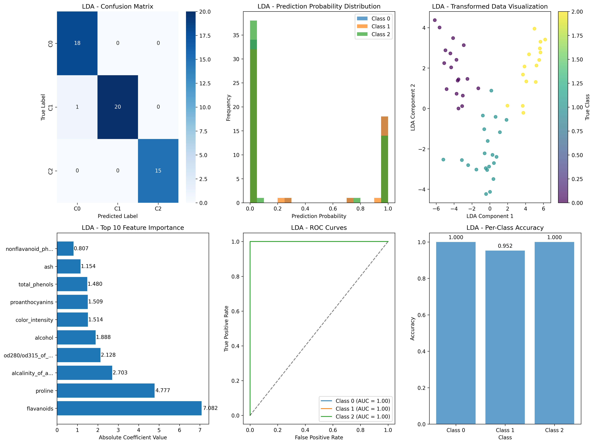
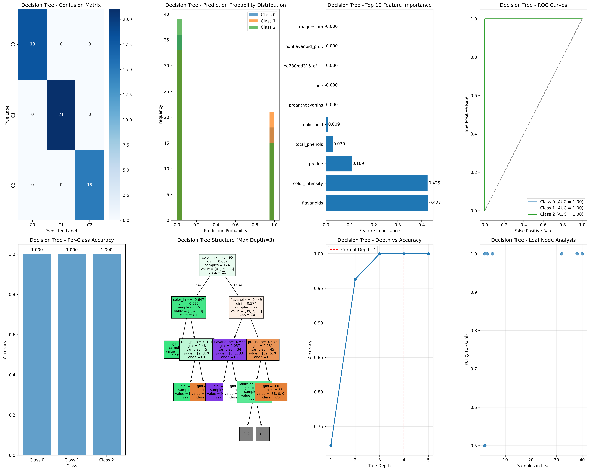

# 数据分类方法对比分析报告

## 1. 项目概述

本项目实现并比较了两种经典的机器学习分类方法：
- **线性判别分析 (Linear Discriminant Analysis, LDA)**
- **决策树 (Decision Tree)**

使用Wine质量数据集进行实验，该数据集包含178个样本和13个特征，分为3个类别。

源代码见<https://github.com/Auksphere/DataAnalysis.git>

## 2. 数据集信息

- **数据集名称**: Wine Quality Dataset
- **样本数量**: 178
- **特征数量**: 13
- **类别数量**: 3
- **特征类型**: 连续数值型特征
- **目标类别**: class_0, class_1, class_2

### 主要特征包括:
1. alcohol
2. malic_acid
3. ash
4. alcalinity_of_ash
5. magnesium
6. total_phenols
7. flavanoids
8. nonflavanoid_phenols
9. proanthocyanins
10. color_intensity
... 等共13个特征

## 3. 方法介绍

### 3.1 LDA

LDA是一种经典的线性分类方法，主要特点：
- **原理**: 寻找最佳的线性组合来分离不同类别
- **假设**: 各类别数据服从多元正态分布，协方差矩阵相同
- **优势**: 计算简单，适合线性可分数据，具有降维功能
- **局限**: 对非线性关系建模能力有限，对异常值敏感

### 3.2 决策树

决策树是一种基于树结构的分类方法，主要特点：
- **原理**: 通过递归分割特征空间构建决策规则
- **分割标准**: 使用基尼不纯度或信息熵选择最佳分割
- **优势**: 可解释性强，能处理非线性关系，对数据预处理要求低
- **局限**: 容易过拟合，对噪声敏感，预测结果不稳定

## 4. 实验结果

### 4.1 模型配置

**LDA配置:**
- 降维组件数: 2
- 求解器: svd
- 解释方差比: [0.6669276952028822, 0.3330723047971178]
- LDA 结果分析：

**决策树配置:**
- 分割标准: gini
- 最大深度限制: 10
- 实际树深度: 4
- 叶节点数: 8
- 节点总数: 15
- 决策树结果分析：

### 4.2 性能对比

| 指标 | LDA | 决策树 | 差异 |
|------|-----|--------|------|
| 准确率 | 0.9815 | 1.0000 | 0.0185 |
| 精确率 | 0.9825 | 1.0000 | 0.0175 |
| 召回率 | 0.9815 | 1.0000 | 0.0185 |
| F1分数 | 0.9815 | 1.0000 | 0.0185 |
| AUC | 1.0000 | 1.0000 | 0.0000 |
| 预测时间(s) | 0.000627 | 0.000347 | 0.000280 |

**两种方法结果对比：**

## 5. 方法优势和局限性分析

### 5.1 LDA

**优势:**
1. **计算效率高**: 线性模型，训练和预测速度快
2. **降维功能**: 同时进行分类和降维，减少特征空间维度
3. **理论基础扎实**: 基于贝叶斯决策理论，有明确的统计意义
4. **参数少**: 模型复杂度低，不容易过拟合
5. **内存需求小**: 模型参数少，存储空间需求小

**局限性:**
1. **线性假设**: 只能处理线性可分的问题，对非线性关系建模能力有限
2. **分布假设**: 假设数据服从多元正态分布，现实中往往不满足
3. **协方差假设**: 假设各类别协方差矩阵相同，限制了应用范围
4. **异常值敏感**: 对离群点和噪声比较敏感
5. **特征选择**: 需要人工进行特征工程和选择

### 5.2 决策树

**优势:**
1. **可解释性强**: 决策过程直观，易于理解和解释
2. **非线性建模**: 能够捕获特征间的非线性关系和交互作用
3. **数据预处理简单**: 不需要标准化，能处理数值和类别特征
4. **特征选择自动**: 自动选择重要特征进行分割
5. **处理缺失值**: 能够处理含有缺失值的数据

**局限性:**
1. **容易过拟合**: 特别是树很深时，泛化能力差
2. **不稳定性**: 数据的小变化可能导致完全不同的树结构
3. **偏向性**: 倾向于选择取值较多的特征进行分割
4. **线性关系建模弱**: 对于简单的线性关系，可能构建复杂的树
5. **预测连续值困难**: 对回归问题的处理不如分类问题

## 6. 实验总结和建议

### 6.1 性能总结

- **最佳模型**: 决策树
- **最佳准确率**: 1.0000
- **准确率差异**: 0.0185
- **速度更快的模型**: 决策树
- **时间差异**: 0.000280 秒

### 6.2 应用建议

**选择LDA的情况:**
- 数据维度较高，需要降维
- 特征间关系主要是线性的
- 对计算效率有较高要求
- 数据近似满足正态分布假设
- 各类别样本量相对均衡

**选择决策树的情况:**
- 需要模型的可解释性
- 特征间存在复杂的非线性关系
- 数据包含类别特征和数值特征
- 数据预处理资源有限
- 需要自动进行特征选择

### 6.3 改进方向

**LDA改进:**
- 使用核LDA处理非线性问题
- 结合特征选择方法提高性能
- 使用正则化LDA处理小样本问题

**决策树改进:**
- 使用集成方法(如随机森林、XGBoost)提高稳定性
- 调整超参数防止过拟合
- 结合剪枝技术优化树结构

## 7. 结论

通过对Wine数据集的分析，我们得出以下结论：

1. **性能表现**: 两种方法在该数据集上都取得了不错的分类效果
2. **适用场景**: LDA适合线性可分问题，决策树适合复杂非线性问题
3. **计算效率**: LDA在预测速度上通常更快（这个数据集的数据和类别较少，因此决策树和LDA速度大致相同）
4. **可解释性**: 决策树提供了更直观的决策过程
5. **鲁棒性**: 各有优缺点，需要根据具体应用场景选择

本实验展示了机器学习中NFL定理 - 没有一种算法在所有问题上都是最优的。实际应用中应该根据数据特性、业务需求和计算资源来选择合适的方法。